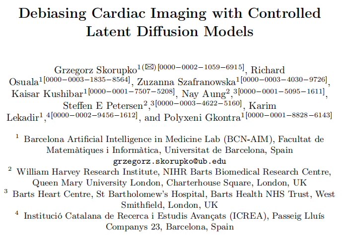

### Debiasing Cardiac Imaging with Controlled Latent Diffusion Models

医学图像生成+潜在扩散+mask引导+ControlNet+OpenCLIP

- [论文](https://arxiv.org/abs/2403.19508)
- [代码](https://github.com/faildeny/debiasing-cardiac-mri)

#### 相关信息

- 时间：28th Mar., 2024
- **期刊：**
- **关键词：**Deep Learning · Generative models · Fairness · Cardiac MRI

#### 文章主要思想

训练细节：

- a single Nvidia 3080Ti GPU with 16GB of memory
- model: (512*512)
  - Stable diffusion 2.1-base model 
  - pretrained 
    - image AutoEncoder network
    - OpenClip [4] text encoder pretrained on the LAION-5B [15] dataset
- fine-tune the ControlNet branch of the model
- parameter
  - batch size: 1;  
  - gradient accumulations: 2
  - learning rate: 1e-5 for 5 epochs
- 3 days