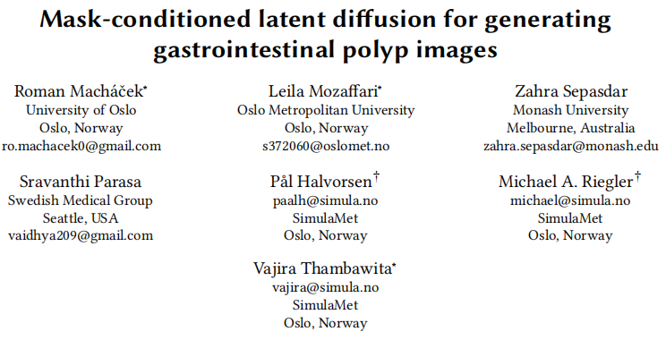
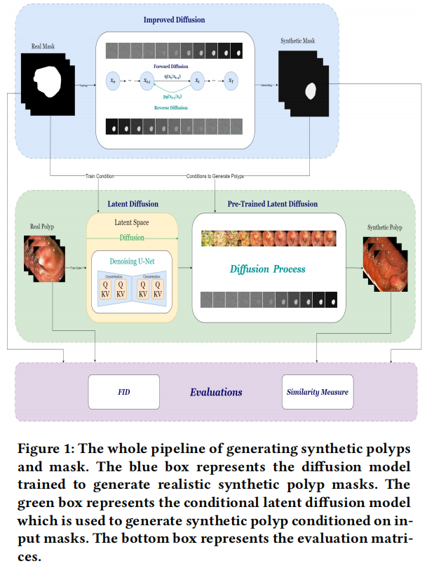

### Mask-conditioned latent diffusion for generating gastrointestinal polyp images

图像生成+潜在扩散+mask生成+mask引导

- [论文](https://arxiv.org/abs/2304.05233)
- [代码](https://github.com/simulamet-host/conditional-polyp-diffusion)

#### 相关信息

- 时间：11th Apr., 2023

- **期刊：**

- **关键词：** diffusion model, polyp generative model, polyp segmentation, gen

  erating synthetic data

#### 文章主要思想

训练：

- mask生成扩散
- 图像生成
  - mask引导+潜在扩散

预测

- 生成mask引导随机潜在噪声生成图像

训练细节

- A server with Nvidia A100 80𝐺𝐵 graphic processing units (GPUs)

  AMD EPYC 7763 64-cores processor with 2𝑇𝐵 RAM