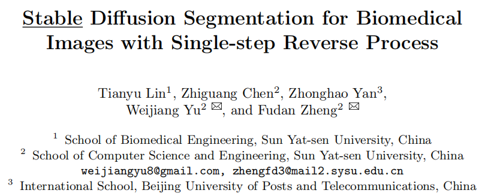
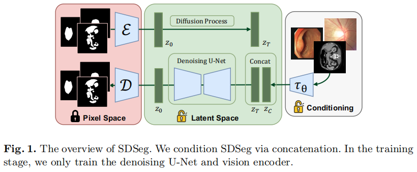

### Stable Diffusion Segmentation for Biomedical Images with Single-step Reverse Process

医学图像分割+潜在扩散+原图引导

- [论文](https://arxiv.org/abs/2406.18361)
- [代码](https://github.com/lin-tianyu/Stable-Diffusion-Seg)

#### 相关信息

- 时间：26th June, 2024

- 期刊：MICCAI, 2024

- 关键词：Biomedical Image Segmentation · Latent Diffusion Model ·

  Stable Diffusion · Reverse Process

#### 文章主要思想

潜在扩散的流程，但是concat了噪声和条件图像，没有attention环节

损失：加了一个 $\mathcal{L}_{latent} = \mathcal{L}(\widetilde{z}_{0},z_{0})$ ，总损失为:
$$
\mathcal{L} = \mathcal{L}_{noise} + \lambda \mathcal{L}_{latent}, \quad \lambda=1
$$

