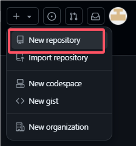
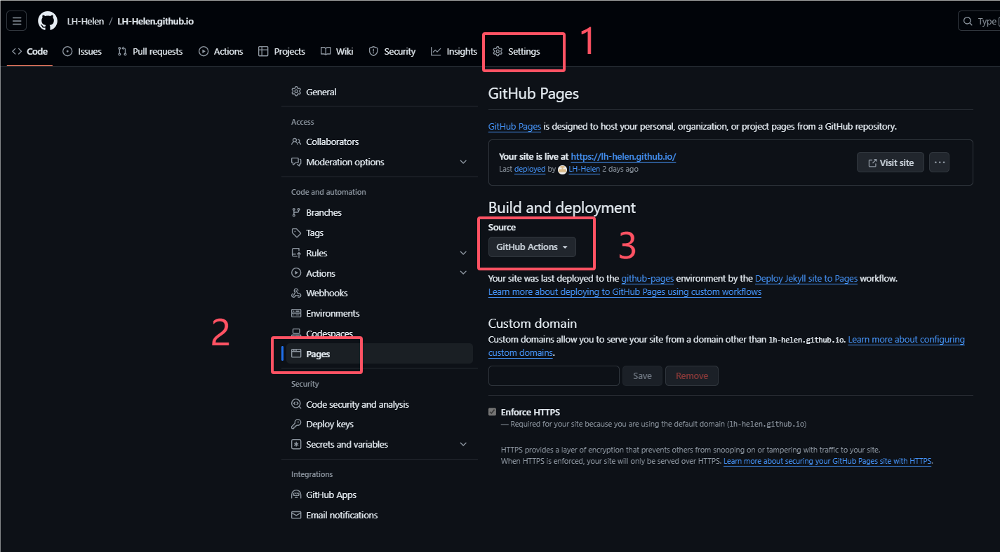
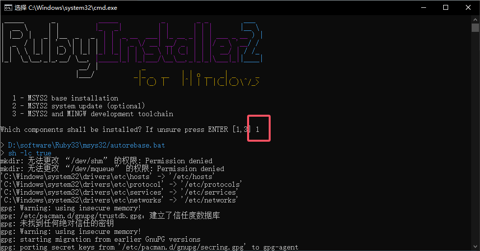
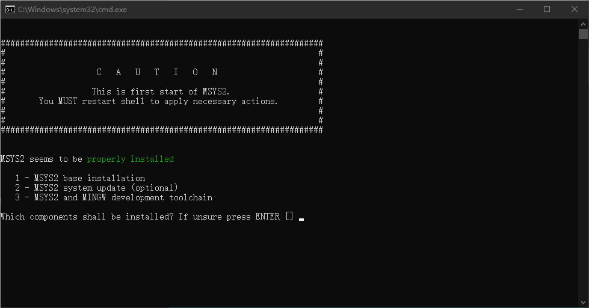
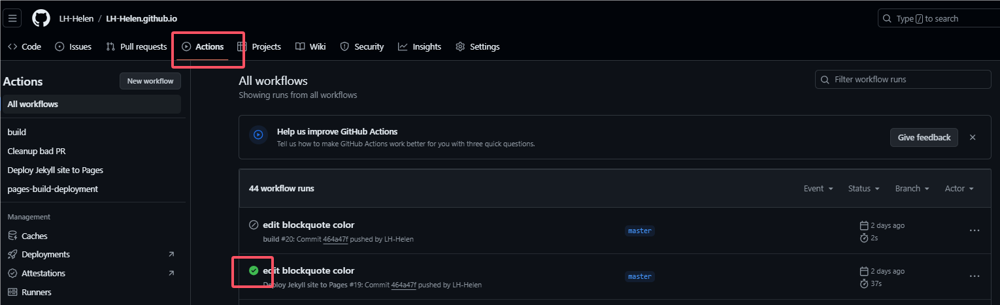

<span id='head'></span>

# Github+jekyll+Minimal Mistakes创建自己的博客

github+jekyll+Minimal Mistakes

## 创建账号

> 参考：[创建GitHub Pages 站点- GitHub 文档](https://docs.github.com/zh/pages/getting-started-with-github-pages/creating-a-github-pages-site)

1. 随便找个github页面，页面右上角，点击加号+

   

2. Owner就是github账户名[username]，仓库名[username].github.io

   

3. 创建好之后，打开新建的仓库，点击setting-->侧边栏的Pages-->选择github actions

   

4. 将这个远程仓库克隆到本地，添加一个index.html , 随便写点啥，push到远程仓库

   - clone操作：

     ```
     git clone https://github.com/your-username/your-repo.git
     ```

   - push操作：

     ```
     git remote add origin https://github.com/your-username/your-repo.git
     git add .
     git commit -m "Initial commit"
     git push -u origin master
     ```

     

5. 等待一会儿就可以成功访问到[username].github.io网站啦！

## 安装ruby+devkit和jekyll

> 参考：[[使用Github pages+jekyll搭建自己的博客（windows版）](https://www.cnblogs.com/zjjDaily/p/8695978.html)](https://www.cnblogs.com/zjjDaily/p/8695978.html)

1. 下载ruby+devkit，这里选with devkit里的，选最新版本就行，x64还是x86看你自己的电脑。

   > 下载官网：https://rubyinstaller.org/downloads/

2. 开始安装软件，如果有提示安全问题，选仍要运行。可以自定义安装路径，一路next。

3. finish之后，会出现一个窗口，让你选择1或者3，我这选了1，基础安装。然后等待它执行完。

   

4. 运行之后，回个车，就安装结束了。

   

5. 然后安装jekyll。win+R输入cmd，调出命令行，输入 gem install jekyll

   ```
   gem install jekyll
   ```

6. 输入 jekyll -v，出现版本号就安装成功了。

   ```
   jekyll -v
   ```

## 找个主题

> 参考：[Jekyll与Github Pages建站](https://qmmms.github.io/posts/Jekyll%E4%B8%8EGithub-pages%E5%BB%BA%E7%AB%99/)

博主使用的是[minimal-mistakes主题](https://github.com/mmistakes/minimal-mistakes)

一些主题网站：

- [Jekyll主题网站](http://jekyllthemes.org/)
- [Jekyll官网的主题](https://jekyllrb.com/showcase/)
- [Github流行统计](https://github.com/topics/jekyll-template)

1. 找到一个心仪的主题后，clone到你的本地仓库。或者download下来，解压到你的本地仓库。直接覆盖就好，没什么留恋的hhhh

2. 命令行输入gem install bundler

   ```
   gem install bundler
   ```

3. 然后，git bash，进入本地仓库，输入bundle install

   ```
   bundle install
   ```

4. 安装好之后，输入bundle exec jekyll s，就可以在本地http://127.0.0.1:4000/预览了

   ```
   bundle exec jekyll s
   ```

5. push到远程仓库，可以看actions里的工作流执行完成后，就代表 [username].github.io 可以查看了

   

好耶，你已经拥有了一个你自己的网站啦！撒花撒花！

接下来就是如何添加博客，以及修改成自己满意的主题风格啦。

## 主题探索

大部分文件组成都是差不多的，除了前端页面设计代码部分。而且一般主题都会有文档说明。如果有什么不会的，可以及时查看官方文档。

像博主选择的主题文件结构组成是这样的：

```
minimal-mistakes
├── _data                      # data files for customizing the theme
|  ├── navigation.yml          # 导航栏在这里修改
|  └── ui-text.yml             # text used throughout the theme's UI
├── _includes
|  ├── analytics-providers     # snippets for analytics (Google and custom)
|  ├── comments-providers      # snippets for comments
|  ├── footer
|  |  └── custom.html          # custom snippets to add to site footer
|  ├── head
|  |  └── custom.html          # custom snippets to add to site head
|  ├── feature_row             # feature row helper
|  ├── gallery                 # image gallery helper
|  ├── group-by-array          # group by array helper for archives
|  ├── nav_list                # navigation list helper
|  ├── toc                     # table of contents helper
|  └── ...
├── _layouts                   # 一些固定模板，想要新建页面的话，可以直接继承这些网页。
|  ├── archive-taxonomy.html   # tag/category archive for Jekyll Archives plugin
|  ├── archive.html            # archive base
|  ├── categories.html         # archive listing posts grouped by category
|  ├── category.html           # archive listing posts grouped by specific category
|  ├── collection.html         # archive listing documents in a specific collection
|  ├── compress.html           # compresses HTML in pure Liquid
|  ├── default.html            # base for all other layouts
|  ├── home.html               # home page
|  ├── posts.html              # archive listing posts grouped by year
|  ├── search.html             # search page
|  ├── single.html             # single document (post/page/etc)
|  ├── tag.html                # archive listing posts grouped by specific tag
|  ├── tags.html               # archive listing posts grouped by tags
|  └── splash.html             # splash page
├── _sass                      # 一些前端css
├── assets					   # 静态文件在这里
|  ├── css
|  |  └── main.scss            # main stylesheet, loads SCSS partials from _sass
|  ├── images                  # image assets for posts/pages/collections/etc.
|  ├── js
|  |  ├── plugins              # jQuery plugins
|  |  ├── vendor               # vendor scripts
|  |  ├── _main.js             # plugin settings and other scripts to load after jQuery
|  |  └── main.min.js          # optimized and concatenated script file loaded before </body>
├── _config.yml                # 配置修改在这里
├── Gemfile                    # gem file dependencies
├── index.html                 # paginated home page showing recent posts
└── package.json               # NPM build scripts

```

### 发博客

在项目中添加 _posts 文件夹，写好的博客都放到这个文件夹里。命名规则是 YYYY-MM-DD-TITLE.md，例如：2016-02-24-welcome-to-jekyll.md。记得push上去，过一会儿就可以看到更新的博客了。


好啦，到此为止就可以简单的发布博客了，后续还会整理一下关于Minimal Mistakes主题的相关探索以及主题修改的踩坑经验。

感谢阅读！☆⌒(*＾-゜)v THX!!