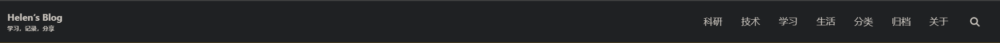
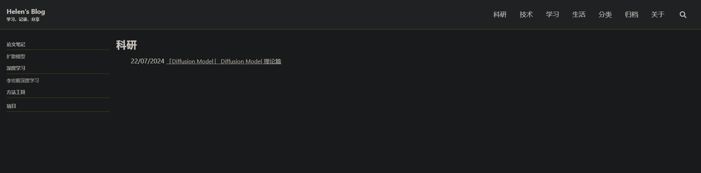
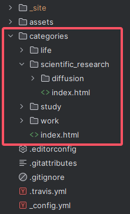
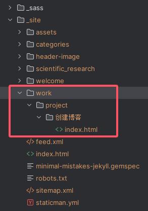

<span id='head'></span>

# Minimal Mistakes 主题探索及个性化修改

上篇：[「Project」Github+jekyll+Minimal Mistakes创建自己的博客](https://lh-helen.github.io//work/project/创建博客/)]

附上[Minimal Mistakes 官方文档](https://mmistakes.github.io/minimal-mistakes/docs/quick-start-guide/)，小部分参考官方文档，大部分靠百度查询 ┑(￣Д ￣)┍

## Gem相关配置

gem可以更好的管理主题文件。`Gemfile` 文件里加了点内容。

```
source "https://rubygems.org"

gem "github-pages", group: :jekyll_plugins
gem "jekyll-include-cache", group: :jekyll_plugins
gem "webrick", "~> 1.8"
```

同时 `_config.yml` 文件中设置 `theme`和 `plugins`：

```
remote_theme : "mmistakes/minimal-mistakes@4.26.2"  # 这里记得把其他theme注释掉
```

```
plugins:
  - jekyll-paginate
  - jekyll-sitemap
  - jekyll-gist
  - jekyll-feed
  - jekyll-include-cache
```

这里注意一下，别按照官方文档删除 `.github` 文件夹，要不然上传会报错。上传的时候github会提醒你在 `.github` -> `workflows` 文件里补充一个 `jekyll.yml` ，文件内容GitHub会直接给你，复制上传就可以了。贴一下内容：

```yaml
# This workflow uses actions that are not certified by GitHub.
# They are provided by a third-party and are governed by
# separate terms of service, privacy policy, and support
# documentation.

# Sample workflow for building and deploying a Jekyll site to GitHub Pages
name: Deploy Jekyll site to Pages

on:
  # Runs on pushes targeting the default branch
  push:
    branches: ["master"]

  # Allows you to run this workflow manually from the Actions tab
  workflow_dispatch:

# Sets permissions of the GITHUB_TOKEN to allow deployment to GitHub Pages
permissions:
  contents: read
  pages: write
  id-token: write

# Allow only one concurrent deployment, skipping runs queued between the run in-progress and latest queued.
# However, do NOT cancel in-progress runs as we want to allow these production deployments to complete.
concurrency:
  group: "pages"
  cancel-in-progress: false

jobs:
  # Build job
  build:
    runs-on: ubuntu-latest
    steps:
      - name: Checkout
        uses: actions/checkout@v4
      - name: Setup Ruby
        uses: ruby/setup-ruby@8575951200e472d5f2d95c625da0c7bec8217c42 # v1.161.0
        with:
          ruby-version: '3.1' # Not needed with a .ruby-version file
          bundler-cache: true # runs 'bundle install' and caches installed gems automatically
          cache-version: 0 # Increment this number if you need to re-download cached gems
      - name: Setup Pages
        id: pages
        uses: actions/configure-pages@v5
      - name: Build with Jekyll
        # Outputs to the './_site' directory by default
        run: bundle exec jekyll build --baseurl "${{ steps.pages.outputs.base_path }}"
        env:
          JEKYLL_ENV: production
      - name: Upload artifact
        # Automatically uploads an artifact from the './_site' directory by default
        uses: actions/upload-pages-artifact@v3

  # Deployment job
  deploy:
    environment:
      name: github-pages
      url: ${{ steps.deployment.outputs.page_url }}
    runs-on: ubuntu-latest
    needs: build
    steps:
      - name: Deploy to GitHub Pages
        id: deployment
        uses: actions/deploy-pages@v4
```

## 配置文件修改

接下来是 `_config.yml` 文件内容修改。这些都是个人喜好了，填什么随意，看心情就好。

主题选择：

```
minimal_mistakes_skin    : "dirt" # "air", "aqua", "contrast", "dark", "dirt", "neon", "mint", "plum", "sunrise"
```

一些网站个人信息的修改：

```
# Site Settings
locale                   : "zh-CN"
rtl                      : # true, false (default) # turns direction of the page into right to left for RTL languages
title                    : "Helen‘s Blog"
title_separator          : "-"
subtitle                 : "学习，记录，分享"# site tagline that appears below site title in masthead
name                     : "Helen Liu"
description              : "Helen‘s Blog!"
url                      : https://lh-helen.github.io/ # the base hostname & protocol for your site e.g. "https://mmistakes.github.io"
baseurl                  : # the subpath of your site, e.g. "/blog"
repository               : LH-Helen/LH-Helen.github.io # GitHub username/repo-name e.g. "mmistakes/minimal-mistakes"
```

```
# Site Author
author:
  name             : "Helen Liu"
  avatar           : # path of avatar image, e.g. "/assets/images/bio-photo.jpg"
  bio              : "I am an **amazing** person."
  location         : "China"
  email            :
```

修改完配置，记得重新 `bundle install` ，本地查看的话就运行 `bundle exec jekyll s` ，然后访问 `http://127.0.0.1:4000/` 。

## 网站内容设置

### 导航栏设置

导航栏设置在 `_data` --> `navigation.yml` 。

头部导航栏是在 `main` 里修改添加，侧边导航栏是在下面添加的，举个例子：

```
main:
  - title: 科研  # 标题设置
    url: /categories/scientific_research  # 网址设置
  - title: 技术
    url: /categories/work
  - title: 学习
    url: /categories/study
  - title: 生活
    url: /categories/life
  - title: 分类
    url: /categories
  - title: 归档
    url: /archive
  - title: 关于
    url: /about

scientific_research:  # 科研页面的侧边导航栏
  - title: 论文笔记
    children:
      - title: 扩散模型
        url: /categories/scientific_research/diffusion
  - title: 深度学习
    children:
      - title: 李宏毅深度学习
        url: /categories/scientific_research/deep_learning
  - title: 方法工具
    url: /categories/scientific_research/tool
  - title: 项目
    url: /categories/scientific_research/project
```

前端的头部导航栏则会显示



科研部分的侧边导航栏显示



### 新建网址

像前面的例子中， `categories/scientific_research` 的网址是需要自己建立的。像`categories/scientific_research` 这个网址需要在目录中添加 `categories` 文件夹以及 `scientific_research` 子文件夹。还是上图吧



然后在`categories` --> `scientific_research` 里添加 `index.html` 文件，文件内容大致是：

```html
---
layout: archive  <!--要继承的页面，在_layout文件夹里面选一个-->
title: 科研  <!--标题设置-->
sidebar:
  nav: scientific_research  <!--侧边栏标题，就是在_data->navigation.yml里自己写的侧边栏导航的标题-->
# articles:
#   excerpt_type: html
---

<ul>
  
    
      
        {{post.date | date:"%d/%m/%Y"}}
        <font size="3"><a href={{post.url}} title={{ cat[0] }}>{{post.title}}</a></font>
        <br>
      
    
  
</ul>
```

html文件内容可以自己设置的。比如我的这个页面继承了 `archive` 页面设置，呈现效果是选择显示所有博客中属于 `scientific_research` 标签的文档。

### 写博客

在项目中添加 `_posts` 文件夹，写好的博客都放到这个文件夹里。

命名规则是 `YYYY-MM-DD-TITLE.md`，例如：2016-02-24-welcome-to-jekyll.md。

文件内容示例：

```
---
title:  "「Project」Github+jekyll+Minimal Mistakes创建自己的博客"
mathjax: true
key: site_blog
toc: true
toc_sticky: true
category: [work, project]
tags: project
---

<span id='head'></span>

# Github+jekyll+Minimal Mistakes创建自己的博客

[https://lh-helen.github.io/](https://lh-helen.github.io/)，这是博主的博客呀，欢迎来访！
```

`_posts` 里是可以建立子文件夹的，这样更方便文档管理。无论怎么建子文件夹，都不会影响 `_site` 里自动编译的存储格式。影响文档的网址只有 `category` 。举个例子，上面的文件内容实例中 `category` 里面有 `work` 和 `project`，那么编译时 `_site` 就会自动添加一个 `work->project` 文件夹，然后建立一个以博客名字为标题的文件夹。上图：



这篇博客的网址就是 `https://lh-helen.github.io/work/project/%E5%88%9B%E5%BB%BA%E5%8D%9A%E5%AE%A2/` ，这串东西其实是创建博客，

## 页面风格修改

这里记录了一些博主对前端页面的个人修改。如果选择的主题有哪些地方不太满意，可以参考参考，自行修改呀(╹ڡ╹ )

前端样式代码大部分都在 `_sass` --> `minimal-mistakes` 这个文件夹里。

### 前端页面大小

原主题的导航栏电脑端只占了半个页面，但是想改成全页面的尺寸。

头部导航栏的css代码是在 `_masthead.scss` 里，可以看到宽度 `max-width` 设置。

```scss
.masthead {
   ......
  
   &__inner-wrap {
	......

    @include breakpoint($x-large) {
      max-width: $max-width;
    }
```

那我们就找找 `$max-width` 这个在哪里吧。在 `_sass` --> `minimal-mistakes` --> `_variables.scss` 里。而 `$max-width` 继承了 `$x-large` ，那就修改 `$x-large`，改成符合全页面尺寸的大小 `1920px` 。

```
/*
   Breakpoints
   ========================================================================== */

$small: 600px !default;
$medium: 768px !default;
$medium-wide: 900px !default;
$large: 1024px !default;
$x-large: 1920px !default; // 原始数值：1280px
$max-width: $x-large !default;
```

### 字体大小修改

字体会随着网页大小的变化而变化，在`_sass` --> `minimal-mistakes` --> `_reset.scss` 中，作者设置了三个变化点，中等尺寸感觉就已经差不多了，所以我们把后两个大尺寸的注释掉。

```scss
html {
  /* apply a natural box layout model to all elements */
  box-sizing: border-box;
  background-color: $background-color;
  font-size: 16px;

  @include breakpoint($medium) {
    font-size: 18px;
  }
  // 删掉
  //@include breakpoint($large) {
  //  font-size: 20px;
  //}
  //
  //@include breakpoint($x-large) {
  //  font-size: 22px;
  //}

  -webkit-text-size-adjust: 100%;
  -ms-text-size-adjust: 100%;
}
```

### 头部导航栏固定

原本网页的头部导航栏是随着页面下滑也会跟着动的，但是博主比较喜欢固定导航栏的设置。开干！

还是 `_masthead.scss` ，在 `.masthead` 里修改 `position` 属性，改为 `fixed`， 再添加 `top` , `left` , `width` 属性。

```scss
.masthead {
  //position: relative;
  position: fixed; // 修改属性为 fixed
  top: 0;          // 固定在顶部
  left: 0;         // 固定在左侧，也可以根据需要设置为居中或右侧
  width: 100%;     // 宽度设置为100%，使其覆盖整个视口宽度
```

然后，发现下滑的时候，主体部分在导航栏里会显示出来，那就给导航栏的背景上个色，这样就看不出来了。太机智了！

在 `&__inner-wrap`里添加 `background-color` 属性

```scss
&__inner-wrap {
    background-color: $background-color;
```

再然后，发现侧边导航栏和目录导航栏也会被遮挡住，改！

通过页面检查找到导航栏的类名：`sidebar.sticky` , 找到 `_sidebar.scss` , 修改 `.sidebar` 里的 `&.sticky` 的属性，添加 `position` 属性，然后设置 `top` 让它距离顶端有一定距离，就不会被挡住了，

```scss
&.sticky {
      overflow-y: auto;
      position: -webkit-sticky;
      position: sticky;
      top: 5em;
      /* calculate height of nav list
         viewport height - nav height - masthead x-padding
      */
      max-height: calc(100vh - #{$nav-height} - 2em);
    }
```

### 公式显示

发现markdown的公式显示不出来，那就在 `_includes` --> `scripts.html` 里加上 `mathjax` 的设置。注意src要用 `cdnjs.cloudflare.com` 的，版本最好用 `2.7.1` 版本。

```html

  <script type="text/x-mathjax-config">
    MathJax.Hub.Config({tex2jax: {inlineMath: [['$','$'], ['\\(','\\)']]}});
  </script>
  <script type="text/javascript"
          src="https://cdnjs.cloudflare.com/ajax/libs/mathjax/2.7.1/MathJax.js?config=TeX-MML-AM_CHTML">
  </script>

  <link rel="stylesheet" href="https://cdn.jsdelivr.net/npm/katex@0.11.1/dist/katex.min.css" integrity="sha384-zB1R0rpPzHqg7Kpt0Aljp8JPLqbXI3bhnPWROx27a9N0Ll6ZP/+DiW/UqRcLbRjq" crossorigin="anonymous">
  <script defer src="https://cdn.jsdelivr.net/npm/katex@0.11.1/dist/katex.min.js" integrity="sha384-y23I5Q6l+B6vatafAwxRu/0oK/79VlbSz7Q9aiSZUvyWYIYsd+qj+o24G5ZU2zJz" crossorigin="anonymous"></script>
  <script defer src="https://cdn.jsdelivr.net/npm/katex@0.11.1/dist/contrib/auto-render.min.js" integrity="sha384-kWPLUVMOks5AQFrykwIup5lo0m3iMkkHrD0uJ4H5cjeGihAutqP0yW0J6dpFiVkI" crossorigin="anonymous" onload="katexReady();"></script>
  <script>
    function katexReady() {
      let renderArea = document.querySelector("section.page__content");
      renderMathInElement(renderArea, {delimiters: [{left: "$$", right: "$$", display: true}]});
      renderMathInElement(renderArea, {delimiters: [{left: "$", right: "$", display: false}]});
    }
  </script>

```

### markdown风格修改


## 问题：

这里记录了一些修改过程中出现的问题，有些忘记记录了，但是大部分的问题都可以百度查到，所以问题不大，大不了从头再来(￣_,￣ )，或者换一个(￣▽￣)"


### webrick

报错：

```
warning: webrick was loaded from the standard library, but is not part of the default gems since Ruby 3.0.0. Add webrick to your Gemfile or gemspec. Also contact author of jekyll-3.9.5 to add webrick into its gemspec.
```

解决：

```
bundle add webtrick
```

> 参考：[[Jekyll 运行的时候提示错误 cannot load such file -- webrick (LoadError)](https://www.cnblogs.com/huyuchengus/p/15473035.html)](https://www.cnblogs.com/huyuchengus/p/15473035.html)

